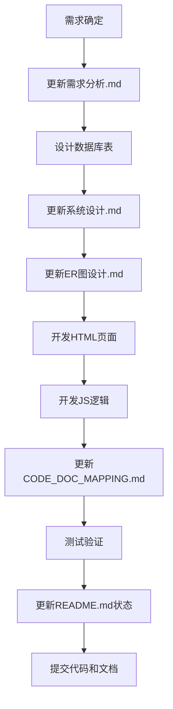
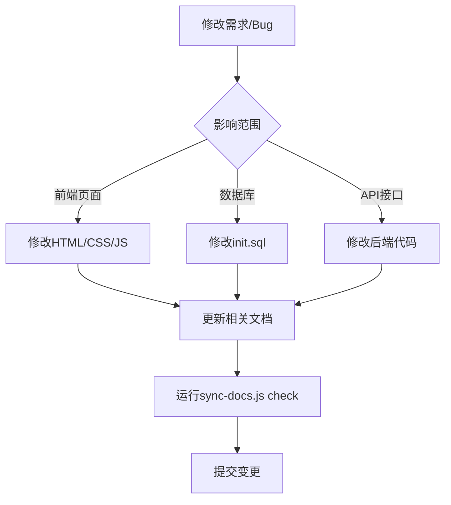

# 代码-文档映射表

## 📋 文档信息

| 项目名称 | 美业客户洞察CRM系统 |
|---------|-------------------|
| 文档版本 | v2.0 |
| 创建日期 | 2025-12-01 |
| 最后更新 | 2025-12-04 |
| 用途 | 建立代码文件与文档章节的映射关系 |
| 更新说明 | 更新页面数量、新增API映射、添加模板管理 |

---

## 一、HTML页面映射

### 1.1 核心业务页面

| HTML文件 | 功能名称 | 功能描述 | 对应文档章节 | 数据表 | API路由 | 状态 |
|---------|---------|---------|-------------|--------|---------|------|
| **index.html** | 数据看板 | 展示核心经营指标、趋势图表、业绩对比 | 需求分析.md#2.2.6 | orders, customers, tasks | - | ✅ 已完成 |
| **customers.html** | 客户列表 | 客户信息管理、搜索筛选、标签管理 | 需求分析.md#2.2.1 | customers | - | ✅ 已完成 |
| **customer-detail.html** | 客户详情 | 客户完整信息、诊断记录、服务历史 | 需求分析.md#2.2.1 | customers, customer_diagnoses, customer_cases | - | ✅ 已完成 |
| **orders.html** | 订单列表 | 订单管理、状态筛选、统计分析 | 需求分析.md#2.2.2 | orders, order_items | /api/orders | ✅ 已完成 |
| **order-detail.html** | 订单详情 | 订单完整信息、服务项目、支付记录 | 需求分析.md#2.2.2 | orders, order_items, services | /api/orders/:id | ✅ 已完成 |
| **tasks.html** | 任务管理 | 任务列表、分配、状态跟踪、提醒 | 需求分析.md#2.2.3 | tasks | - | ✅ 已完成 |
| **cases.html** | 客户案例 | 成功案例展示、前后对比、效果说明 | 需求分析.md#2.2.1 | customer_cases | /api/cases | ✅ 已完成 |

### 1.2 模板管理页面 ⭐ 新增

| HTML文件 | 功能名称 | 功能描述 | 对应文档章节 | 数据表 | API路由 | 状态 |
|---------|---------|---------|-------------|--------|---------|------|
| **templates.html** | 方案模板 | 护理方案模板库、分类管理、使用统计 | 需求分析.md#2.2.4 | solution_templates | /api/solution-templates | ✅ 已完成 |
| **customer-profile-templates.html** | 客户模板 | 客户资料字段模板、自定义表单配置 | 系统设计.md#2.2.6 | customer_profile_templates | /api/customer-profile-templates | ✅ 已完成 |
| **task-templates.html** | 任务模板 | 任务流程模板、标准化步骤配置 | 系统设计.md#2.2.6 | task_templates | /api/task-templates | ✅ 已完成 |

### 1.3 组织与用户管理 ⭐ 新增

| HTML文件 | 功能名称 | 功能描述 | 对应文档章节 | 数据表 | API路由 | 状态 |
|---------|---------|---------|-------------|--------|---------|------|
| **organizations.html** | 组织管理 | 组织信息管理、组织切换、权限控制 | 需求分析.md#2.2.5 | organizations | /api/organizations | ✅ 已完成 |
| **franchisees.html** | 加盟商管理 | 加盟商信息、业绩统计、合同管理 | 需求分析.md#2.2.5 | organizations | /api/franchisees | ✅ 已完成 |
| **users.html** | 用户管理 | 内部员工账号管理、密码修改 | 需求分析.md#2.2.7 | users, user_roles | /api/users | ✅ 已完成 |
| **roles.html** | 角色管理 | 角色权限配置、数据权限范围 | 需求分析.md#2.2.7 | roles, role_permissions | /api/roles | ✅ 已完成 |
| **settings.html** | 系统设置 | 系统参数配置、主题设置 | 需求分析.md#2.2.7 | - | - | ✅ 已完成 |

### 1.4 测试与调试页面

| HTML文件 | 功能名称 | 功能描述 | 用途 | 状态 |
|---------|---------|---------|------|------|
| **test.html** | 测试页面 | 通用测试页面 | 开发测试 | ✅ 已完成 |
| **test-detail.html** | 详情测试 | 详情页面布局测试 | 开发测试 | ✅ 已完成 |
| **test-data-check.html** | 数据检查 | IndexedDB数据检查工具 | 开发测试 | ✅ 已完成 |
| **test-change-password.html** | 密码测试 | 修改密码功能测试 | 功能测试 | ✅ 已完成 |
| **test-password-change.html** | 密码修改测试 | 密码修改功能测试页面 | 功能测试 | ✅ 已完成 |
| **theme-test.html** | 主题测试 | 主题配置功能测试 | 功能测试 | ✅ 已完成 |
| **data-validation.html** | 数据验证 | IndexedDB数据验证和调试 | 开发调试 | ✅ 已完成 |
| **clear-data.html** | 数据清理 | 清除本地IndexedDB数据 | 开发调试 | ✅ 已完成 |
| **mobile-gestures-demo.html** | 手势演示 | 移动端触摸手势功能演示 | 功能演示 | ✅ 已完成 |
| **franchisees-api.html** | API测试 | 加盟商API接口测试 | API测试 | ✅ 已完成 |

**统计**：生产页面 15个 | 测试页面 10个 | 总计 25个

---

## 二、JavaScript模块映射

### 2.1 核心工具库

| JS文件 | 模块名称 | 主要功能 | 对应文档章节 | 依赖 |
|-------|---------|---------|-------------|------|
| **js/utils.js** | 工具函数库 | 日期格式化、数据验证、防抖节流、导出功能 | 系统设计.md#6.3 | 无 |
| **js/db.js** | 数据库操作 | IndexedDB封装、数据CRUD、查询接口 | 系统设计.md#二 | 无 |
| **js/api.js** | API调用封装 ⭐ | 10个模块API封装、请求拦截、错误处理 | 系统设计.md#三 | 无 |
| **js/mobile-gestures.js** | 移动端手势 | 触摸手势识别、滑动操作、手势事件 | 需求分析.md#3.3 | 无 |

### 2.2 后端API模块 ⭐ 新增

| 文件路径 | 模块名称 | 主要功能 | 端点数量 | 状态 |
|---------|---------|---------|---------|------|
| **api/server.js** | 服务器启动 | 启动Express服务器、数据库连接检查 | - | ✅ 运行中 |
| **api/app.js** | 应用配置 | Express中间件配置、路由注册 | - | ✅ 已完成 |
| **api/routes/organizations.js** | 组织管理 | 组织CRUD、查询接口 | 5 | ✅ 已完成 |
| **api/routes/users.js** | 用户管理 | 用户CRUD、密码修改 | 6 | ✅ 已完成 |
| **api/routes/roles.js** | 角色管理 | 角色CRUD、权限分配 | 5 | ✅ 已完成 |
| **api/routes/franchisees.js** | 加盟商管理 | 加盟商CRUD、业绩统计 | 5 | ✅ 已完成 |
| **api/routes/cases.js** | 客户案例 | 案例CRUD、精选管理 | 5 | ✅ 已完成 |
| **api/routes/orders.js** | 订单管理 | 订单CRUD、状态更新 | 5 | ✅ 已完成 |
| **api/routes/solution-templates.js** | 方案模板 | 模板CRUD、分类查询 | 5 | ✅ 已完成 |
| **api/routes/customer-profile-templates.js** | 客户模板 | 客户模板CRUD、字段配置 | 5 | ✅ 已完成 |
| **api/routes/task-templates.js** | 任务模板 | 任务模板CRUD、步骤配置 | 5 | ✅ 已完成 |
| **api/routes/ai.js** | AI接口 | AI分析、智能推荐 | 2 | ✅ 已完成 |

### 2.2 功能模块（页面内嵌）

| 页面 | 模块功能 | 技术要点 |
|-----|---------|---------|
| **index.html** | 图表渲染（Canvas原生）、实时数据更新 | Canvas API、统计算法 |
| **customers.html** | 客户列表渲染、搜索筛选、分页 | IndexedDB查询、前端分页 |
| **customer-detail.html** | 客户信息编辑、诊断记录管理 | 表单验证、数据联动 |
| **orders.html** | 订单列表、状态管理、导出 | 状态机、Excel导出 |
| **tasks.html** | 任务分配、提醒设置 | 日期计算、本地通知 |

---

## 三、数据库表映射

### 3.1 组织机构相关

| 表名 | 中文名称 | 对应文档章节 | 关联页面 | 关键字段 |
|-----|---------|-------------|---------|---------|
| **organizations** | 机构表 | 系统设计.md#2.2.1 | franchisees.html | org_code, org_type, parent_id |
| **users** | 用户表 | 系统设计.md#2.2.2 | settings.html | username, org_id, password_hash |
| **roles** | 角色表 | 系统设计.md#2.2.2 | settings.html | role_code, data_scope |
| **user_roles** | 用户角色关联表 | 系统设计.md#2.2.2 | settings.html | user_id, role_id |
| **permissions** | 权限表 | 系统设计.md#2.2.2 | settings.html | permission_code, resource_type |
| **role_permissions** | 角色权限关联表 | 系统设计.md#2.2.2 | settings.html | role_id, permission_id |

### 3.2 客户管理相关

| 表名 | 中文名称 | 对应文档章节 | 关联页面 | 关键字段 |
|-----|---------|-------------|---------|---------|
| **customers** | 客户表 | 系统设计.md#2.2.3 | customers.html, customer-detail.html | customer_no, phone, member_level |
| **customer_diagnoses** | 客户诊断表 | 系统设计.md#2.2.3 | customer-detail.html | customer_id, skin_type, diagnose_date |
| **customer_cases** | 客户案例表 | 系统设计.md#2.2.3 | cases.html, customer-detail.html | customer_id, case_type, is_featured |

### 3.3 订单管理相关

| 表名 | 中文名称 | 对应文档章节 | 关联页面 | 关键字段 |
|-----|---------|-------------|---------|---------|
| **orders** | 订单表 | 系统设计.md#2.2.4 | orders.html, order-detail.html | order_no, customer_id, order_status |
| **order_items** | 订单明细表 | 系统设计.md#2.2.4 | order-detail.html | order_id, service_id, quantity |
| **services** | 服务项目表 | 系统设计.md#2.2.4 | order-detail.html, templates.html | service_code, category, standard_price |

### 3.4 任务与模板

| 表名 | 中文名称 | 对应文档章节 | 关联页面 | 关键字段 |
|-----|---------|-------------|---------|---------|
| **tasks** | 任务表 | 系统设计.md#2.2.5 | tasks.html | task_no, assigned_to, status |
| **solution_templates** | 方案模板表 | 系统设计.md#2.2.6 | templates.html | template_code, category, scope |
| **customer_profile_templates** | 客户资料模板表 ⭐ | 系统设计.md#2.2.6 | customer-profile-templates.html | template_code, fields, scope |
| **task_templates** | 任务模板表 ⭐ | 系统设计.md#2.2.6 | task-templates.html | template_code, steps, category |

### 3.5 系统日志

| 表名 | 中文名称 | 对应文档章节 | 关联页面 | 关键字段 |
|-----|---------|-------------|---------|---------|
| **operation_logs** | 操作日志表 | 系统设计.md#2.2.7 | - | user_id, module, action |

---

## 四、API接口映射（已实现）⭐

### 4.1 组织管理接口

| 接口路径 | HTTP方法 | 功能 | 实现文件 | 关联表 | 状态 |
|---------|---------|------|---------|--------|------|
| `/api/organizations` | GET | 获取组织列表 | api/routes/organizations.js | organizations | ✅ |
| `/api/organizations/:id` | GET | 获取组织详情 | api/routes/organizations.js | organizations | ✅ |
| `/api/organizations` | POST | 创建组织 | api/routes/organizations.js | organizations | ✅ |
| `/api/organizations/:id` | PUT | 更新组织 | api/routes/organizations.js | organizations | ✅ |
| `/api/organizations/:id` | DELETE | 删除组织 | api/routes/organizations.js | organizations | ✅ |

### 4.2 用户管理接口

| 接口路径 | HTTP方法 | 功能 | 实现文件 | 关联表 | 状态 |
|---------|---------|------|---------|--------|------|
| `/api/users` | GET | 获取用户列表 | api/routes/users.js | users | ✅ |
| `/api/users/:id` | GET | 获取用户详情 | api/routes/users.js | users | ✅ |
| `/api/users` | POST | 创建用户 | api/routes/users.js | users | ✅ |
| `/api/users/:id` | PUT | 更新用户 | api/routes/users.js | users | ✅ |
| `/api/users/:id` | DELETE | 删除用户 | api/routes/users.js | users | ✅ |
| `/api/users/:id/password` | PUT | 修改用户密码 | api/routes/users.js | users | ✅ |

### 4.3 角色管理接口

| 接口路径 | HTTP方法 | 功能 | 实现文件 | 关联表 | 状态 |
|---------|---------|------|---------|--------|------|
| `/api/roles` | GET | 获取角色列表 | api/routes/roles.js | roles | ✅ |
| `/api/roles/:id` | GET | 获取角色详情 | api/routes/roles.js | roles | ✅ |
| `/api/roles` | POST | 创建角色 | api/routes/roles.js | roles | ✅ |
| `/api/roles/:id` | PUT | 更新角色 | api/routes/roles.js | roles | ✅ |
| `/api/roles/:id` | DELETE | 删除角色 | api/routes/roles.js | roles | ✅ |

### 4.4 加盟商管理接口

| 接口路径 | HTTP方法 | 功能 | 实现文件 | 关联表 | 状态 |
|---------|---------|------|---------|--------|------|
| `/api/franchisees` | GET | 获取加盟商列表 | api/routes/franchisees.js | organizations | ✅ |
| `/api/franchisees/:id` | GET | 获取加盟商详情 | api/routes/franchisees.js | organizations | ✅ |
| `/api/franchisees` | POST | 创建加盟商 | api/routes/franchisees.js | organizations | ✅ |
| `/api/franchisees/:id` | PUT | 更新加盟商 | api/routes/franchisees.js | organizations | ✅ |
| `/api/franchisees/:id` | DELETE | 删除加盟商 | api/routes/franchisees.js | organizations | ✅ |

### 4.5 客户案例接口

| 接口路径 | HTTP方法 | 功能 | 实现文件 | 关联表 | 状态 |
|---------|---------|------|---------|--------|------|
| `/api/cases` | GET | 获取案例列表 | api/routes/cases.js | customer_cases | ✅ |
| `/api/cases/:id` | GET | 获取案例详情 | api/routes/cases.js | customer_cases | ✅ |
| `/api/cases` | POST | 创建案例 | api/routes/cases.js | customer_cases | ✅ |
| `/api/cases/:id` | PUT | 更新案例 | api/routes/cases.js | customer_cases | ✅ |
| `/api/cases/:id` | DELETE | 删除案例 | api/routes/cases.js | customer_cases | ✅ |

### 4.6 订单管理接口

| 接口路径 | HTTP方法 | 功能 | 实现文件 | 关联表 | 状态 |
|---------|---------|------|---------|--------|------|
| `/api/orders` | GET | 获取订单列表 | api/routes/orders.js | orders | ✅ |
| `/api/orders/:id` | GET | 获取订单详情 | api/routes/orders.js | orders, order_items | ✅ |
| `/api/orders` | POST | 创建订单 | api/routes/orders.js | orders, order_items | ✅ |
| `/api/orders/:id` | PUT | 更新订单 | api/routes/orders.js | orders | ✅ |
| `/api/orders/:id` | DELETE | 删除订单 | api/routes/orders.js | orders | ✅ |

### 4.7 方案模板接口

| 接口路径 | HTTP方法 | 功能 | 实现文件 | 关联表 | 状态 |
|---------|---------|------|---------|--------|------|
| `/api/solution-templates` | GET | 获取方案模板列表 | api/routes/solution-templates.js | solution_templates | ✅ |
| `/api/solution-templates/:id` | GET | 获取模板详情 | api/routes/solution-templates.js | solution_templates | ✅ |
| `/api/solution-templates` | POST | 创建模板 | api/routes/solution-templates.js | solution_templates | ✅ |
| `/api/solution-templates/:id` | PUT | 更新模板 | api/routes/solution-templates.js | solution_templates | ✅ |
| `/api/solution-templates/:id` | DELETE | 删除模板 | api/routes/solution-templates.js | solution_templates | ✅ |

### 4.8 客户资料模板接口 ⭐

| 接口路径 | HTTP方法 | 功能 | 实现文件 | 关联表 | 状态 |
|---------|---------|------|---------|--------|------|
| `/api/customer-profile-templates` | GET | 获取客户模板列表 | api/routes/customer-profile-templates.js | customer_profile_templates | ✅ |
| `/api/customer-profile-templates/:id` | GET | 获取模板详情 | api/routes/customer-profile-templates.js | customer_profile_templates | ✅ |
| `/api/customer-profile-templates` | POST | 创建模板 | api/routes/customer-profile-templates.js | customer_profile_templates | ✅ |
| `/api/customer-profile-templates/:id` | PUT | 更新模板 | api/routes/customer-profile-templates.js | customer_profile_templates | ✅ |
| `/api/customer-profile-templates/:id` | DELETE | 删除模板 | api/routes/customer-profile-templates.js | customer_profile_templates | ✅ |

### 4.9 任务模板接口 ⭐

| 接口路径 | HTTP方法 | 功能 | 实现文件 | 关联表 | 状态 |
|---------|---------|------|---------|--------|------|
| `/api/task-templates` | GET | 获取任务模板列表 | api/routes/task-templates.js | task_templates | ✅ |
| `/api/task-templates/:id` | GET | 获取模板详情 | api/routes/task-templates.js | task_templates | ✅ |
| `/api/task-templates` | POST | 创建模板 | api/routes/task-templates.js | task_templates | ✅ |
| `/api/task-templates/:id` | PUT | 更新模板 | api/routes/task-templates.js | task_templates | ✅ |
| `/api/task-templates/:id` | DELETE | 删除模板 | api/routes/task-templates.js | task_templates | ✅ |

### 4.10 AI接口

| 接口路径 | HTTP方法 | 功能 | 实现文件 | 关联表 | 状态 |
|---------|---------|------|---------|--------|------|
| `/api/ai/analyze` | POST | AI分析 | api/routes/ai.js | - | ✅ |
| `/api/ai/recommend` | POST | AI推荐 | api/routes/ai.js | - | ✅ |

---

## 五、CSS样式映射

### 5.1 样式文件

| CSS文件 | 功能 | 关联页面 | 特性 |
|--------|------|---------|------|
| **css/styles.css** | 全局样式 | 所有页面 | 基础布局、通用组件 |
| **css/mobile-optimizations.css** | 移动端优化 | 所有页面 | 响应式布局、触摸优化 |

### 5.2 使用的CSS框架

| 框架/库 | 版本 | 引入方式 | 用途 |
|--------|------|---------|------|
| **Tailwind CSS** | 3.3+ | CDN | 原子化CSS工具类 |
| **Lucide Icons** | latest | CDN | 图标库 |

---

## 六、功能-文档交叉索引

### 6.1 按功能查找文档

#### 客户管理

- **需求说明**：需求分析.md#2.2.1
- **界面实现**：customers.html, customer-detail.html
- **数据库设计**：系统设计.md#2.2.3
- **ER图**：ER图设计.md（customers, customer_diagnoses, customer_cases）
- **API接口**：系统设计.md#3.2.2

#### 订单管理

- **需求说明**：需求分析.md#2.2.2
- **界面实现**：orders.html, order-detail.html
- **数据库设计**：系统设计.md#2.2.4
- **ER图**：ER图设计.md（orders, order_items, services）
- **API接口**：系统设计.md#3.2.3

#### 任务管理

- **需求说明**：需求分析.md#2.2.3
- **界面实现**：tasks.html
- **数据库设计**：系统设计.md#2.2.5
- **ER图**：ER图设计.md（tasks）

#### 加盟商管理

- **需求说明**：需求分析.md#2.2.5
- **界面实现**：franchisees.html
- **数据库设计**：系统设计.md#2.2.1
- **ER图**：ER图设计.md（organizations）

#### 权限管理

- **需求说明**：需求分析.md#2.2.7
- **界面实现**：settings.html
- **权限设计**：系统设计.md#四
- **数据库设计**：系统设计.md#2.2.2
- **ER图**：ER图设计.md（users, roles, permissions）

#### 组织管理 ⭐

- **需求说明**：需求分析.md#2.2.5
- **界面实现**：organizations.html, franchisees.html
- **数据库设计**：系统设计.md#2.2.1
- **ER图**：ER图设计.md（organizations）
- **API接口**：api/routes/organizations.js, api/routes/franchisees.js

#### 用户管理 ⭐

- **需求说明**：需求分析.md#2.2.7
- **界面实现**：users.html
- **数据库设计**：系统设计.md#2.2.2
- **ER图**：ER图设计.md（users, user_roles）
- **API接口**：api/routes/users.js

#### 角色管理 ⭐

- **需求说明**：需求分析.md#2.2.7
- **界面实现**：roles.html
- **数据库设计**：系统设计.md#2.2.2
- **ER图**：ER图设计.md（roles, permissions, role_permissions）
- **API接口**：api/routes/roles.js

#### 客户资料模板 ⭐

- **需求说明**：系统设计.md#2.2.6
- **界面实现**：customer-profile-templates.html
- **数据库设计**：系统设计.md#2.2.6
- **表结构文档**：database/customer-profile-templates-design.sql
- **API接口**：api/routes/customer-profile-templates.js

#### 任务模板 ⭐

- **需求说明**：系统设计.md#2.2.6
- **界面实现**：task-templates.html
- **数据库设计**：系统设计.md#2.2.6
- **表结构文档**：database/task-templates-design.sql
- **API接口**：api/routes/task-templates.js

### 6.2 按文档查找代码

#### 需求分析.md

| 章节 | 对应代码文件 |
|-----|------------|
| 2.2.1 客户管理 | customers.html, customer-detail.html, cases.html |
| 2.2.2 订单管理 | orders.html, order-detail.html |
| 2.2.3 任务管理 | tasks.html, task-templates.html ⭐ |
| 2.2.4 方案模板 | templates.html, customer-profile-templates.html ⭐ |
| 2.2.5 加盟商管理 | franchisees.html, organizations.html ⭐ |
| 2.2.6 数据看板 | index.html |
| 2.2.7 系统设置 | settings.html, users.html ⭐, roles.html ⭐ |

#### 系统设计.md

| 章节 | 对应代码文件 |
|-----|------------|
| 2.2.1 organizations表 | database/init.sql, franchisees.html, organizations.html ⭐ |
| 2.2.2 users/roles/permissions表 | database/init.sql, settings.html, users.html ⭐, roles.html ⭐ |
| 2.2.3 customers表 | database/init.sql, customers.html |
| 2.2.4 orders表 | database/init.sql, orders.html, api/routes/orders.js ⭐ |
| 2.2.5 tasks表 | database/init.sql, tasks.html, task-templates.html ⭐ |
| 2.2.6 模板表 ⭐ | customer-profile-templates.html, task-templates.html, templates.html |
| 3.2 API接口设计 | api/app.js, api/routes/*.js（10个模块，已实现） ⭐ |
| 6.3 性能优化 | js/utils.js（防抖节流） |

#### ER图设计.md

| ER图实体 | 对应SQL表 | 对应页面 |
|---------|----------|---------|
| organizations | database/init.sql | franchisees.html, organizations.html ⭐ |
| users | database/init.sql | settings.html, users.html ⭐ |
| roles | database/init.sql | roles.html ⭐ |
| customers | database/init.sql | customers.html |
| orders | database/init.sql | orders.html |
| tasks | database/init.sql | tasks.html |
| solution_templates | database/init.sql | templates.html |
| customer_profile_templates ⭐ | database/customer-profile-templates-design.sql | customer-profile-templates.html |
| task_templates ⭐ | database/task-templates-design.sql | task-templates.html |

---

## 七、开发流程映射

### 7.1 新增功能的代码-文档同步流程

### 7.2 修改功能的同步流程

---

## 八、文档维护清单

### 8.1 新增HTML页面时

- [ ] 更新本文档"HTML页面映射"章节
- [ ] 更新需求分析.md中的功能清单
- [ ] 更新README.md（如需要）
- [ ] 运行 `node scripts/sync-docs.js check`

### 8.2 新增数据表时

- [ ] 更新系统设计.md中的表结构设计
- [ ] 更新ER图设计.md中的ER图
- [ ] 更新本文档"数据库表映射"章节
- [ ] 更新README.md中的核心表清单

### 8.3 新增API接口时

- [ ] 更新系统设计.md中的接口设计章节
- [ ] 更新本文档"API接口映射"章节
- [ ] 编写接口使用示例

### 8.4 功能完成时

- [ ] 更新需求分析.md中的功能状态
- [ ] 更新README.md中的开发计划
- [ ] 更新本文档中的状态标识

---

## 九、快速查找指南

### 9.1 我想找...

**客户管理相关的所有资料**
- 需求：需求分析.md#2.2.1
- 页面：customers.html, customer-detail.html, cases.html
- 数据表：customers, customer_diagnoses, customer_cases
- 文档章节：系统设计.md#2.2.3

**订单相关的数据库设计**
- SQL脚本：database/init.sql（搜索 "CREATE TABLE orders"）
- 设计文档：系统设计.md#2.2.4
- ER图：ER图设计.md

**权限控制的实现方案**
- 设计文档：系统设计.md#四
- 数据表：roles, permissions, user_roles, role_permissions
- 页面：settings.html

**移动端优化的说明**
- 需求：需求分析.md#3.3
- CSS：css/mobile-optimizations.css
- JS：js/mobile-gestures.js
- 演示：mobile-gestures-demo.html

### 9.2 常用搜索关键词

| 关键词 | 对应资源 |
|-------|---------|
| "客户" | customers.html, customers表, 需求分析.md#2.2.1 |
| "订单" | orders.html, orders表, 需求分析.md#2.2.2 |
| "任务" | tasks.html, tasks表, 需求分析.md#2.2.3 |
| "加盟商" | franchisees.html, organizations表 |
| "权限" | settings.html, roles/permissions表, 系统设计.md#四 |
| "RBAC" | 系统设计.md#4.1, ER图设计.md#2 |
| "多租户" | 系统设计.md#2.1, 需求分析.md#2.3 |

---

## 十、更新日志

| 日期 | 版本 | 更新内容 | 更新人 |
|-----|------|---------|--------|
| 2025-12-01 | v1.0 | 初始版本：建立完整的代码-文档映射关系 | Claude |
| 2025-12-04 | v2.0 | 重大更新：页面25个、API模块10个、数据表17张、全面反映生产环境状态 | Claude Code |

**v2.0 主要更新内容**：
- ✅ HTML页面映射：13个 → 25个（新增模板管理、组织用户管理等12个页面）
- ✅ 后端API模块：新增完整的10个API模块映射
- ✅ 数据库表映射：15张 → 17张（新增客户模板、任务模板表）
- ✅ API接口映射：从"规划"更新为"已实现"，10个模块52个接口
- ✅ 交叉索引：新增组织管理、用户管理、角色管理、客户模板、任务模板
- ✅ 代码文件映射：更新所有章节，反映实际实现状态

---

**文档版本**：v2.0
**最后更新**：2025-12-04
**维护团队**：美业CRM开发团队

**说明**：本文档会随着项目开发持续更新，请保持与代码同步。
