# 美业客户洞察CRM系统 - 数据库ER图

## 📊 实体关系图（Entity Relationship Diagram）

### 完整ER图（Mermaid格式）

```mermaid
erDiagram
    %% 组织机构相关
    organizations ||--o{ organizations : "parent"
    organizations ||--o{ users : "employs"
    organizations ||--o{ customers : "serves"
    organizations ||--o{ orders : "processes"
    organizations ||--o{ tasks : "owns"
    organizations ||--o{ services : "offers"
    organizations ||--o{ solution_templates : "creates"

    %% 用户权限相关
    users ||--o{ user_roles : "has"
    roles ||--o{ user_roles : "assigned to"
    roles ||--o{ role_permissions : "has"
    permissions ||--o{ role_permissions : "granted to"

    %% 客户相关
    users ||--o{ customers : "counsels"
    customers ||--o{ customer_diagnoses : "diagnosed"
    customers ||--o{ customer_cases : "showcased in"
    customers ||--o{ orders : "places"
    customers ||--o{ tasks : "related to"

    %% 订单相关
    orders ||--o{ order_items : "contains"
    services ||--o{ order_items : "included in"
    users ||--o{ orders : "serves"

    %% 任务相关
    users ||--o{ tasks : "assigned"
    orders ||--o{ tasks : "generates"

    %% 操作日志
    users ||--o{ operation_logs : "performs"

    %% 表定义
    organizations {
        bigint id PK
        varchar org_code UK
        varchar org_name
        enum org_type
        bigint parent_id FK
        tinyint level
        enum franchisee_level
        varchar contract_no
        date contract_start_date
        date contract_end_date
        decimal revenue_share_rate
        varchar contact_person
        varchar contact_phone
        varchar contact_email
        varchar province
        varchar city
        varchar district
        varchar address
        decimal longitude
        decimal latitude
        enum status
        varchar logo_url
        text description
        timestamp created_at
        timestamp updated_at
        bigint created_by
        bigint updated_by
        tinyint is_deleted
    }

    users {
        bigint id PK
        varchar username UK
        varchar password_hash
        varchar real_name
        bigint org_id FK
        varchar phone
        varchar email
        enum gender
        varchar avatar_url
        varchar position
        enum status
        timestamp last_login_at
        varchar last_login_ip
        int login_count
        timestamp created_at
        timestamp updated_at
        bigint created_by
        bigint updated_by
        tinyint is_deleted
    }

    roles {
        bigint id PK
        varchar role_code UK
        varchar role_name
        varchar description
        enum data_scope
        enum status
        timestamp created_at
        timestamp updated_at
        bigint created_by
        tinyint is_deleted
    }

    user_roles {
        bigint id PK
        bigint user_id FK
        bigint role_id FK
        timestamp created_at
        bigint created_by
    }

    permissions {
        bigint id PK
        varchar permission_code UK
        varchar permission_name
        enum resource_type
        bigint parent_id FK
        varchar route_path
        varchar icon
        int sort_order
        enum status
        timestamp created_at
        timestamp updated_at
        tinyint is_deleted
    }

    role_permissions {
        bigint id PK
        bigint role_id FK
        bigint permission_id FK
        timestamp created_at
        bigint created_by
    }

    customers {
        bigint id PK
        varchar customer_no UK
        varchar name
        enum gender
        date birth_date
        varchar phone
        varchar id_card
        varchar province
        varchar city
        varchar district
        varchar address
        bigint org_id FK
        bigint store_id FK
        bigint counselor_id FK
        enum source_channel
        bigint referrer_id
        enum member_level
        int member_points
        json tags
        decimal total_consumption
        int total_orders
        timestamp last_visit_at
        text remark
        enum status
        timestamp created_at
        timestamp updated_at
        bigint created_by
        bigint updated_by
        tinyint is_deleted
    }

    customer_diagnoses {
        bigint id PK
        bigint customer_id FK
        bigint org_id FK
        date diagnose_date
        bigint diagnosed_by FK
        enum skin_type
        json skin_problems
        json skin_sensitivity
        enum hair_type
        json hair_problems
        varchar scalp_condition
        json diagnose_data
        json photos
        text suggestions
        timestamp created_at
        timestamp updated_at
        bigint created_by
        tinyint is_deleted
    }

    customer_cases {
        bigint id PK
        bigint customer_id FK
        bigint org_id FK
        varchar case_title
        enum case_type
        varchar service_period
        varchar service_frequency
        text initial_problems
        text treatment_plan
        json products_used
        text results
        json before_photos
        json after_photos
        text customer_feedback
        tinyint satisfaction_score
        tinyint is_featured
        tinyint is_public
        int display_order
        timestamp created_at
        timestamp updated_at
        bigint created_by
        bigint updated_by
        tinyint is_deleted
    }

    services {
        bigint id PK
        varchar service_code
        varchar service_name
        enum category
        varchar subcategory
        bigint org_id FK
        decimal standard_price
        decimal vip_price
        int duration_minutes
        text description
        text benefits
        json suitable_for
        varchar cover_image
        tinyint is_featured
        int display_order
        enum status
        timestamp created_at
        timestamp updated_at
        bigint created_by
        bigint updated_by
        tinyint is_deleted
    }

    orders {
        bigint id PK
        varchar order_no UK
        bigint customer_id FK
        varchar customer_name
        varchar customer_phone
        bigint org_id FK
        bigint store_id FK
        bigint counselor_id FK
        bigint beautician_id FK
        decimal original_amount
        decimal discount_amount
        decimal final_amount
        enum payment_method
        enum payment_status
        decimal paid_amount
        timestamp paid_at
        enum order_status
        date service_date
        time service_start_time
        time service_end_time
        text remark
        text cancel_reason
        timestamp created_at
        timestamp updated_at
        bigint created_by
        bigint updated_by
        tinyint is_deleted
    }

    order_items {
        bigint id PK
        bigint order_id FK
        bigint org_id FK
        bigint service_id FK
        varchar service_name
        varchar service_category
        decimal unit_price
        int quantity
        decimal discount_rate
        decimal subtotal
        bigint beautician_id FK
        timestamp created_at
    }

    tasks {
        bigint id PK
        varchar task_no UK
        varchar title
        text description
        enum task_type
        enum priority
        bigint customer_id FK
        bigint order_id FK
        bigint org_id FK
        bigint assigned_to FK
        bigint assigned_by FK
        date due_date
        timestamp reminder_time
        timestamp completed_at
        enum status
        text completion_note
        timestamp created_at
        timestamp updated_at
        bigint created_by
        bigint updated_by
        tinyint is_deleted
    }

    solution_templates {
        bigint id PK
        varchar template_code
        varchar template_name
        enum category
        bigint org_id FK
        enum scope
        json suitable_skin_types
        json suitable_problems
        varchar target_group
        varchar course_duration
        varchar treatment_frequency
        json steps
        json products
        json services
        text expected_effects
        text precautions
        decimal estimated_price_min
        decimal estimated_price_max
        varchar cover_image
        json case_photos
        int usage_count
        enum status
        timestamp created_at
        timestamp updated_at
        bigint created_by
        bigint updated_by
        tinyint is_deleted
    }

    operation_logs {
        bigint id PK
        bigint user_id FK
        varchar username
        bigint org_id FK
        varchar module
        varchar action
        varchar description
        varchar request_method
        varchar request_url
        json request_params
        int response_status
        int response_time
        varchar ip_address
        varchar user_agent
        timestamp created_at
    }
```



---

## 📋 核心关系说明

### 1. 组织机构关系

```
organizations (总部)
    ├── organizations (加盟商A)  [parent_id → 总部ID]
    │   ├── organizations (门店A-1)  [parent_id → 加盟商A ID]
    │   └── organizations (门店A-2)
    └── organizations (加盟商B)
        └── organizations (门店B-1)
```

**关系**：
- 自关联：`parent_id` → `organizations.id`
- 层级：1-总部, 2-加盟商, 3-门店

### 2. 用户-角色-权限关系（RBAC）

```
users (用户)
    ↓ M:N
user_roles (中间表)
    ↓ M:N
roles (角色)
    ↓ M:N
role_permissions (中间表)
    ↓ M:N
permissions (权限)
```

**关系类型**：
- 用户 ←→ 角色：多对多（一个用户可有多个角色）
- 角色 ←→ 权限：多对多（一个角色拥有多个权限）

### 3. 客户生命周期关系

```
customers (客户)
    ├── customer_diagnoses (诊断记录) [1:N]
    ├── customer_cases (成功案例) [1:N]
    ├── orders (订单) [1:N]
    └── tasks (任务) [1:N]
```

**关系**：
- 一个客户可以有多次诊断记录
- 一个客户可以关联多个成功案例
- 一个客户可以下多个订单
- 一个客户可以有多个待办任务

### 4. 订单关系

```
customers (客户)
    ↓ 1:N
orders (订单)
    ↓ 1:N
order_items (订单明细)
    ↓ N:1
services (服务项目)
```

**关系**：
- 客户 → 订单：一对多
- 订单 → 订单明细：一对多
- 服务项目 → 订单明细：一对多

### 5. 任务关系

```
customers (客户) ----→ tasks (任务)  [customer_id]
orders (订单) -------→ tasks (任务)  [order_id]
users (用户) --------→ tasks (任务)  [assigned_to]
```

**关系**：
- 客户可关联任务（如生日关怀）
- 订单可生成任务（如售后跟踪）
- 用户被分配任务

---

## 🔑 关键约束

### 主键约束

所有表使用自增ID作为主键：
```sql
id BIGINT UNSIGNED AUTO_INCREMENT PRIMARY KEY
```

### 唯一约束

```sql
-- 机构编码唯一
organizations.org_code UNIQUE

-- 用户名唯一
users.username UNIQUE

-- 客户编号唯一
customers.customer_no UNIQUE

-- 订单编号唯一
orders.order_no UNIQUE

-- 任务编号唯一
tasks.task_no UNIQUE

-- 角色编码唯一
roles.role_code UNIQUE

-- 权限编码唯一
permissions.permission_code UNIQUE

-- 用户-角色组合唯一
user_roles(user_id, role_id) UNIQUE

-- 角色-权限组合唯一
role_permissions(role_id, permission_id) UNIQUE

-- 机构-服务编码组合唯一
services(org_id, service_code) UNIQUE

-- 机构-模板编码组合唯一
solution_templates(org_id, template_code) UNIQUE
```

### 外键约束

**关键外键**：
```sql
-- 用户所属机构
users.org_id → organizations.id (ON DELETE RESTRICT)

-- 客户所属机构/门店
customers.org_id → organizations.id (ON DELETE RESTRICT)
customers.store_id → organizations.id (ON DELETE RESTRICT)
customers.counselor_id → users.id (ON DELETE SET NULL)

-- 订单关联
orders.customer_id → customers.id (ON DELETE RESTRICT)
orders.org_id → organizations.id (ON DELETE RESTRICT)
order_items.order_id → orders.id (ON DELETE CASCADE)

-- 诊断记录关联
customer_diagnoses.customer_id → customers.id (ON DELETE CASCADE)
customer_diagnoses.diagnosed_by → users.id (ON DELETE RESTRICT)

-- 任务分配
tasks.assigned_to → users.id (ON DELETE RESTRICT)
tasks.customer_id → customers.id (ON DELETE SET NULL)

-- 用户角色关联
user_roles.user_id → users.id (ON DELETE CASCADE)
user_roles.role_id → roles.id (ON DELETE CASCADE)

-- 角色权限关联
role_permissions.role_id → roles.id (ON DELETE CASCADE)
role_permissions.permission_id → permissions.id (ON DELETE CASCADE)
```

**删除策略**：
- `RESTRICT`：禁止删除（保护重要关联）
- `CASCADE`：级联删除（清理子数据）
- `SET NULL`：置空（可选关联）

---

## 📊 索引设计

### 关键索引

```sql
-- 机构表
idx_parent_id (parent_id)
idx_org_type (org_type)
idx_status (status)

-- 用户表
idx_org_id (org_id)
idx_phone (phone)
idx_status (status)

-- 客户表
idx_phone (phone)
idx_org_id (org_id)
idx_store_id (store_id)
idx_counselor_id (counselor_id)
idx_member_level (member_level)
idx_status (status)

-- 订单表
idx_customer_id (customer_id)
idx_org_id (org_id)
idx_store_id (store_id)
idx_order_status (order_status)
idx_payment_status (payment_status)
idx_service_date (service_date)

-- 任务表
idx_customer_id (customer_id)
idx_assigned_to (assigned_to)
idx_org_id (org_id)
idx_status (status)
idx_task_type (task_type)
idx_due_date (due_date)
```

### 复合索引建议

```sql
-- 客户按机构和状态查询
CREATE INDEX idx_customer_org_status
ON customers(org_id, status, created_at);

-- 订单按门店和日期查询
CREATE INDEX idx_order_store_date
ON orders(store_id, service_date, order_status);

-- 任务按执行人和状态查询
CREATE INDEX idx_task_assignee_status
ON tasks(assigned_to, status, due_date);
```

---

## 🔄 数据流向

### 客户下单流程

```
1. 客户到店
   customers (查询/创建)

2. 诊断评估
   customer_diagnoses (创建诊断记录)

3. 选择服务
   services (查询可用服务)

4. 创建订单
   orders (创建订单)
   order_items (创建明细)

5. 服务执行
   orders.order_status → 'in_progress'

6. 完成结算
   orders.order_status → 'completed'
   orders.payment_status → 'paid'
   customers.total_consumption += final_amount
   customers.total_orders += 1

7. 售后跟踪
   tasks (创建回访任务)
```

### 加盟商入驻流程

```
1. 创建加盟商机构
   organizations (org_type='franchisee', parent_id=1)

2. 创建门店
   organizations (org_type='store', parent_id=加盟商ID)

3. 创建管理员账号
   users (org_id=加盟商ID)

4. 分配角色
   user_roles (user_id, role_id='franchisee_admin')

5. 授权菜单
   role_permissions (角色关联权限)
```

---

## 📈 数据增长预估

### 3年数据量

| 表名 | 预估行数 | 年增长 | 备注 |
|-----|---------|--------|------|
| organizations | 750 | 250/年 | 加盟商+门店 |
| users | 3,000 | 1000/年 | 员工账号 |
| customers | 150,000 | 50000/年 | 客户 |
| orders | 1,500,000 | 500000/年 | 订单 |
| order_items | 3,000,000 | 1000000/年 | 订单明细 |
| tasks | 600,000 | 200000/年 | 任务 |
| customer_diagnoses | 300,000 | 100000/年 | 诊断记录 |
| operation_logs | 10,000,000+ | 可按月归档 | 操作日志 |

### 优化建议

**当订单表超过100万条时**：
- 考虑按年份分区
- 历史数据归档
- 读写分离

**当日志表持续增长时**：
- 按月分表
- 定期归档到日志服务器
- 保留近3个月在线数据

---

## 🎯 总结

本ER图展示了美业CRM系统的完整数据模型，包括：

- ✅ **15张核心表**
- ✅ **多租户架构**（org_id隔离）
- ✅ **RBAC权限模型**（用户-角色-权限）
- ✅ **完整业务流程**（客户-订单-任务-案例）
- ✅ **审计追踪**（操作日志）
- ✅ **软删除机制**（is_deleted）
- ✅ **扩展字段**（JSON类型）

数据库设计遵循：
- 📊 **第三范式**（减少冗余）
- 🔐 **安全性**（密码哈希、数据加密）
- ⚡ **性能优化**（索引设计、分区策略）
- 🔄 **可扩展性**（JSON扩展、预留字段）

---

**文档版本**：v1.0
**创建日期**：2025-12-01
**维护团队**：美业CRM开发团队
