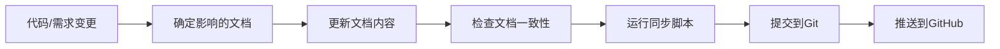

# 文档维护指南

## 📋 文档信息

| 项目名称 | 美业客户洞察CRM系统 |
| ---- | ----------- |
| 文档版本 | v1.0        |
| 创建日期 | 2025-12-01  |
| 维护团队 | 美业CRM开发团队   |

---

## 一、文档体系概览

### 1.1 文档结构

```
docs/
├── README.md                    # 文档导航和项目概览
├── 需求分析.md                  # 业务需求和功能需求
├── 系统设计.md                  # 系统架构和技术设计
├── ER图设计.md                  # 数据库ER图和关系说明
├── CODE_DOC_MAPPING.md          # 代码-文档映射表
└── MAINTAIN.md                  # 本文档（维护指南）
```

### 1.2 文档定位

| 文档名称 | 主要读者 | 更新频率 | 重要性 |
|---------|---------|---------|--------|
| **README.md** | 所有人 | 每次大版本更新 | ⭐⭐⭐⭐⭐ |
| **需求分析.md** | 产品经理、业务人员 | 需求变更时 | ⭐⭐⭐⭐⭐ |
| **系统设计.md** | 技术团队 | 架构变更时 | ⭐⭐⭐⭐⭐ |
| **ER图设计.md** | DBA、后端开发 | 表结构变更时 | ⭐⭐⭐⭐ |
| **CODE_DOC_MAPPING.md** | 开发团队 | 代码变更时 | ⭐⭐⭐ |
| **MAINTAIN.md** | 文档维护者 | 流程变更时 | ⭐⭐⭐ |

---

## 二、文档更新流程

### 2.1 何时更新文档

#### 触发场景

| 场景 | 需要更新的文档 | 更新内容 |
|-----|--------------|---------|
| **新增HTML页面** | 需求分析.md, CODE_DOC_MAPPING.md | 功能模块清单、页面映射 |
| **新增数据表** | 系统设计.md, ER图设计.md | 表结构定义、ER图更新 |
| **修改表字段** | 系统设计.md, ER图设计.md | 字段说明更新 |
| **新增API接口** | 系统设计.md | 接口设计章节 |
| **功能完成** | 需求分析.md, README.md | 完成状态、开发进度 |
| **技术选型变更** | 系统设计.md | 技术栈说明 |
| **需求变更** | 需求分析.md | 功能需求、验收标准 |
| **版本发布** | README.md | 版本规划、更新记录 |

### 2.2 更新步骤

#### 标准流程



#### 详细步骤

**步骤1：确定需要更新的文档**

参考 `.claude/doc-sync-config.json` 中的 `updateTriggers` 配置。

**步骤2：编辑文档**

- 使用支持Markdown的编辑器（推荐VS Code、Typora、Obsidian）
- 保持格式一致性
- 遵循文档规范（见第三章）

**步骤3：检查文档质量**

```bash
# 检查文档状态和链接
node scripts/sync-docs.js check

# 检查文档链接有效性
node scripts/sync-docs.js links
```

**步骤4：提交到Git**

```bash
# 查看变更
git status

# 添加文档
git add docs/

# 提交（使用规范的提交信息）
git commit -m "docs: 更新XXX文档 - 新增YYY功能说明"

# 推送到远程
git push origin master
```

**或使用同步脚本一键完成**：

```bash
# 完整同步流程（检查 + 提交 + 推送）
node scripts/sync-docs.js sync

# 或分步执行
node scripts/sync-docs.js commit "更新系统设计文档"
node scripts/sync-docs.js push
```

---

## 三、文档编写规范

### 3.1 Markdown语法规范

#### 标题层级

```markdown
# 一级标题（文档标题，仅1个）
## 二级标题（章节）
### 三级标题（小节）
#### 四级标题（细节）
```

**规则**：
- 一级标题仅用于文档标题
- 标题层级不要跳跃（如从二级直接到四级）
- 标题后空一行再写正文

#### 列表格式

**无序列表**：

```markdown
- 第一项
- 第二项
  - 子项1
  - 子项2
- 第三项
```

**有序列表**：

```markdown
1. 第一步
2. 第二步
3. 第三步
```

**任务列表**：

```markdown
- [x] 已完成的任务
- [ ] 未完成的任务
```

#### 表格格式

```markdown
| 列1 | 列2 | 列3 |
|-----|-----|-----|
| 数据1 | 数据2 | 数据3 |
| 数据4 | 数据5 | 数据6 |
```

**规则**：
- 表头与内容之间用 `|-----|` 分隔
- 列宽自动对齐，无需手动调整
- 复杂表格可使用HTML `<table>` 标签

#### 代码块

**行内代码**：

```markdown
使用 `反引号` 包裹代码
```

**代码块**：

````markdown
```javascript
const hello = 'world';
console.log(hello);
```

```sql
SELECT * FROM customers WHERE status = 'active';
```
````

**规则**：
- 必须指定语言（javascript、sql、bash等）
- 代码块前后各空一行

#### 链接

**内部链接**（链接到本仓库文件）：

```markdown
[需求分析文档](./需求分析.md)
[数据库设计](./系统设计.md#二数据库设计)
```

**外部链接**：

```markdown
[MySQL官方文档](https://dev.mysql.com/doc/)
```

**规则**：
- 内部链接使用相对路径
- 链接文本要有意义，避免"点击这里"
- 确保链接有效（使用 `sync-docs.js links` 检查）

### 3.2 内容规范

#### 术语统一

| 正确 | 错误 | 说明 |
|-----|------|------|
| 客户 | 用户、顾客 | 使用"客户"统一指代服务对象 |
| 机构 | 组织、公司 | 使用"机构"指代organizations |
| 加盟商 | 代理商、经销商 | 使用"加盟商"统一 |
| 订单 | 工单、单据 | 使用"订单"统一 |
| 任务 | 待办、TODO | 使用"任务"统一 |

#### 日期格式

**统一使用**：`YYYY-MM-DD` 格式

```markdown
✅ 2025-12-01
❌ 2025/12/01
❌ 12-01-2025
❌ 2025年12月1日
```

#### 版本号格式

遵循语义化版本规范（Semver）：`主版本号.次版本号.修订号`

```markdown
v1.0.0  - 初始版本
v1.1.0  - 新增功能
v1.1.1  - Bug修复
v2.0.0  - 重大变更
```

#### 状态标识

使用Emoji或标签标识状态：

```markdown
- ✅ 已完成
- 🔄 进行中
- ⏸️ 暂停
- ❌ 已取消
- 📋 计划中
```

### 3.3 文档模板

#### 新增功能文档模板

```markdown
## 功能名称

### 功能描述

简要说明功能的用途和价值。

### 使用场景

- 场景1：XXX
- 场景2：YYY

### 功能设计

#### 界面设计

- 页面位置：XXX
- 关键元素：XXX

#### 数据流程

1. 用户操作
2. 系统处理
3. 结果反馈

#### 相关表结构

| 表名 | 字段 | 说明 |
|-----|------|------|
| customers | name | 客户姓名 |

### 验收标准

- [ ] 功能正常运行
- [ ] 数据正确保存
- [ ] 权限控制有效

### 相关文件

- 前端页面：`customers.html`
- 数据表：`customers`
- API接口：`/api/v1/customers`
```

---

## 四、文档质量检查

### 4.1 自动化检查

#### 使用同步脚本

```bash
# 完整检查
node scripts/sync-docs.js check

# 输出示例
📊 检查文档状态...

✅ docs/README.md
   状态: unchanged
   修改时间: 2025-12-01 11:48:53
   哈希: a1b2c3d4...

⚠️ docs/系统设计.md
   状态: modified
   修改时间: 2025-12-01 12:30:15
   哈希: e5f6g7h8...

🔗 检查文档链接...

✅ 所有链接有效

🔍 检查文档与代码一致性...

📄 发现 15 个HTML页面
🗄️ 发现 15 张数据表

✅ 文档与代码保持一致
```

### 4.2 手动检查清单

#### 内容检查

- [ ] 标题层级正确，无跳跃
- [ ] 所有链接有效
- [ ] 代码示例可运行
- [ ] 表格格式规范
- [ ] 术语使用统一
- [ ] 日期格式统一（YYYY-MM-DD）
- [ ] 版本号正确

#### 一致性检查

- [ ] 文档提到的表名存在于 `database/init.sql`
- [ ] 文档提到的HTML页面存在
- [ ] API接口文档与实际代码一致
- [ ] 版本号与README一致
- [ ] 最后更新日期正确

#### 可读性检查

- [ ] 段落长度适中（3-5句）
- [ ] 使用列表和表格提高可读性
- [ ] 关键信息使用加粗或高亮
- [ ] 有足够的代码示例
- [ ] 有清晰的图表说明（如需要）

---

## 五、常见文档更新场景

### 5.1 新增HTML页面

**场景**：开发了新的客户详情页面 `customer-detail.html`

**更新步骤**：

1. **更新 `docs/需求分析.md`**

   在"功能需求"章节添加功能说明：

   ```markdown
   #### 2.2.1 客户管理模块

   **基础功能**：
   - [x] 客户信息管理
   - [x] 客户详情页面  # 新增
   ```

2. **更新 `docs/CODE_DOC_MAPPING.md`**

   在"HTML页面映射"章节添加：

   ```markdown
   | customer-detail.html | 客户详情 | 需求分析.md#2.2.1 |
   ```

3. **运行检查并提交**

   ```bash
   node scripts/sync-docs.js sync
   ```

### 5.2 新增数据库表

**场景**：在 `database/init.sql` 中新增了 `customer_feedback` 表

**更新步骤**：

1. **更新 `docs/系统设计.md`**

   在"2.2 核心表结构设计"章节添加表定义：

   ```markdown
   ##### 16. customer_feedback - 客户反馈表

   ```sql
   CREATE TABLE customer_feedback (
       id BIGINT UNSIGNED AUTO_INCREMENT PRIMARY KEY,
       customer_id BIGINT UNSIGNED NOT NULL,
       -- ...
   );
   ```
   ```

2. **更新 `docs/ER图设计.md`**

   在Mermaid ER图中添加新表及关系。

3. **更新 `docs/README.md`**

   在"核心表"清单中添加：

   ```markdown
   16. **customer_feedback** - 客户反馈表
   ```

4. **提交更新**

   ```bash
   git add docs/ database/
   git commit -m "docs: 新增客户反馈表文档"
   git push
   ```

### 5.3 修改表字段

**场景**：在 `customers` 表中新增了 `wechat` 字段

**更新步骤**：

1. **更新 `docs/系统设计.md`**

   在 `customers` 表定义中添加字段：

   ```sql
   wechat VARCHAR(50) DEFAULT NULL COMMENT '微信号',
   ```

2. **添加变更记录**

   在文档末尾"变更历史"中记录：

   ```markdown
   | 2025-12-01 | v1.1 | customers表新增wechat字段 | 张三 |
   ```

3. **提交**

   ```bash
   node scripts/sync-docs.js commit "更新customers表字段说明"
   node scripts/sync-docs.js push
   ```

### 5.4 功能完成

**场景**：客户管理模块开发完成

**更新步骤**：

1. **更新 `docs/需求分析.md`**

   将功能状态从 `[ ]` 改为 `[x]`。

2. **更新 `docs/README.md`**

   在"开发计划"中更新进度：

   ```markdown
   - [x] 客户管理模块  # 从 [ ] 改为 [x]
   ```

3. **提交**

   ```bash
   git commit -m "docs: 标记客户管理模块为已完成"
   ```

---

## 六、工具使用指南

### 6.1 文档同步脚本

#### 安装依赖

```bash
# 确保已安装Node.js 14+
node --version

# 项目根目录执行（如需创建package.json）
npm init -y
```

#### 命令说明

```bash
# 检查文档状态
node scripts/sync-docs.js check

# 查看Git状态
node scripts/sync-docs.js status

# 检查链接有效性
node scripts/sync-docs.js links

# 对比本地与远程差异
node scripts/sync-docs.js diff

# 提交文档更新
node scripts/sync-docs.js commit "更新说明"

# 推送到GitHub
node scripts/sync-docs.js push

# 完整同步（推荐）
node scripts/sync-docs.js sync

# 显示帮助
node scripts/sync-docs.js help
```

### 6.2 推荐编辑器

#### VS Code

**推荐扩展**：

- **Markdown All in One**：Markdown增强
- **markdownlint**：语法检查
- **Markdown Preview Enhanced**：预览增强
- **Code Spell Checker**：拼写检查

**配置**：

```json
{
  "markdown.preview.fontSize": 14,
  "markdown.preview.lineHeight": 1.6,
  "[markdown]": {
    "editor.defaultFormatter": "esbenp.prettier-vscode",
    "editor.formatOnSave": true
  }
}
```

#### Typora

- 所见即所得的Markdown编辑器
- 支持实时预览
- 支持导出PDF、Word等格式

#### Obsidian

- 双链笔记
- 支持可视化知识图谱
- 本地存储，隐私安全
- 本项目 `docs/.obsidian/` 已配置

### 6.3 Git提交规范

#### 提交信息格式

```
<type>(<scope>): <subject>

<body>

<footer>
```

#### Type类型

- `docs`: 文档更新
- `feat`: 新功能
- `fix`: Bug修复
- `refactor`: 代码重构
- `style`: 格式调整
- `test`: 测试相关
- `chore`: 构建/工具变更

#### 示例

```bash
# 简单提交
git commit -m "docs: 更新系统设计文档"

# 详细提交
git commit -m "docs(database): 新增客户反馈表设计

- 添加customer_feedback表结构定义
- 更新ER图中的关系
- 补充使用场景说明

Refs: #123"
```

---

## 七、常见问题

### 7.1 文档相关

**Q: 如何在文档中引用代码？**

A: 使用相对路径链接到具体代码文件：

```markdown
详见 [数据库配置示例](../database/db.config.example.js)
```

**Q: 如何处理中文文件名？**

A:
- 文件名使用中文（如 `需求分析.md`）
- Git和GitHub完全支持
- 确保文件编码为UTF-8

**Q: 如何插入图片？**

A:
```markdown

```

建议图片存放在 `docs/images/` 目录。

### 7.2 同步相关

**Q: 推送失败怎么办？**

A:
```bash
# 1. 检查网络连接
ping github.com

# 2. 检查远程仓库
git remote -v

# 3. 拉取最新代码
git pull origin master

# 4. 解决冲突后重新推送
git push origin master
```

**Q: 文档与代码不一致怎么办？**

A:
```bash
# 运行一致性检查
node scripts/sync-docs.js check

# 根据提示更新对应文档
```

### 7.3 工具相关

**Q: sync-docs.js 运行报错？**

A:
```bash
# 检查Node.js版本（需要14+）
node --version

# 检查配置文件是否存在
ls -la .claude/doc-sync-config.json

# 检查是否在Git仓库中
git status
```

**Q: 如何自定义同步规则？**

A: 编辑 `.claude/doc-sync-config.json`，参考配置说明调整规则。

---

## 八、最佳实践

### 8.1 文档编写习惯

1. **小步快跑**：代码变更后立即更新文档，不要积压
2. **详细注释**：代码示例加上注释说明
3. **版本控制**：重大变更记录版本号和日期
4. **定期检查**：每周运行一次 `sync-docs.js check`
5. **链接检查**：每月检查一次外部链接有效性

### 8.2 团队协作

1. **分工明确**：
   - 产品经理维护需求分析.md
   - 架构师维护系统设计.md
   - DBA维护ER图设计.md
   - 开发维护CODE_DOC_MAPPING.md

2. **代码审查**：
   - PR中包含文档变更
   - Review时检查文档完整性

3. **定期同步**：
   - 每周五下午统一同步文档
   - 版本发布前全面检查

### 8.3 文档存档

**重要版本文档备份**：

```bash
# 创建存档目录
mkdir -p docs/archives

# 备份当前版本
cp -r docs/*.md docs/archives/v1.0.0-2025-12-01/
```

---

## 九、联系与支持

### 9.1 文档问题反馈

- **GitHub Issues**: https://github.com/jiangopen8/beauty-crm/issues
- **内部沟通**：项目钉钉群

### 9.2 文档改进建议

欢迎提出文档改进建议！

**提交方式**：
1. 在GitHub提Issue
2. 提交PR直接修改文档
3. 在团队会议上讨论

---

## 十、附录

### 10.1 文档清单

| 文档 | 大小 | 最后更新 | 维护者 |
|-----|------|---------|--------|
| README.md | 9KB | 2025-12-01 | 全员 |
| 需求分析.md | 15KB | 2025-12-01 | 产品经理 |
| 系统设计.md | 49KB | 2025-12-01 | 架构师 |
| ER图设计.md | 16KB | 2025-12-01 | DBA |
| CODE_DOC_MAPPING.md | - | 2025-12-01 | 开发团队 |
| MAINTAIN.md | - | 2025-12-01 | 文档管理员 |

### 10.2 相关资源

- [Markdown语法指南](https://www.markdownguide.org/)
- [语义化版本规范](https://semver.org/lang/zh-CN/)
- [约定式提交规范](https://www.conventionalcommits.org/zh-hans/)
- [GitHub文档最佳实践](https://guides.github.com/features/wikis/)

---

**文档版本**：v1.0
**最后更新**：2025-12-01
**维护团队**：美业CRM开发团队
